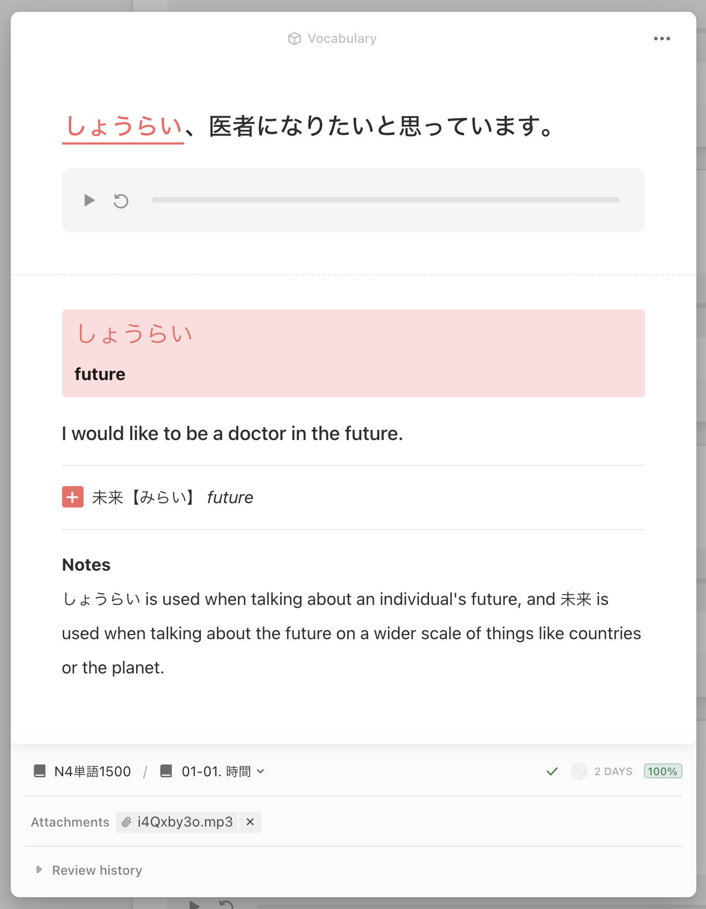

# Mochi Templates and Themes
Templates and supporting themes for Mochi.

## Changelog
### 2023-02-11
- Update `Vocabulary` template to actually include the `Related Word` update 😬 ごめん
- Added new `Taro` theme!
### 2023-01-01
- Added `Related Word`, `Related Reading`, and `Related Meaning` fields to Vocabulary template. These can be used to add an additional related word to your cards when needed.

## Templates
### Vocabulary
This template is useful for learning vocabulary through sentences. It comprises of the following fields:

| Name | Type |
|------|------|
| Japanese A* | Text |
| Japanese B | Text |
| English A | Text |
| English B | Text |
| Word | Text |
| Reading | Text |
| Meaning | Text |
| Audio | Text |
| Related Word | Text |
| Related Reading | Text |
| Related Meaning | Text |
| Notes | Text |

To use, fill out at minimum the `Japanese A`, `English A`, `Word`, `Reading`, and `Meaning` fields. Highlight your target word or grammar point using `==Example==`:

For example, if we're learning the word しょうらい, we could create the following card:

| Field | Value |
|-------|-------|
| Japanese A* | `==しょうらい==、医者になりたいと思っています。` |
| English A | `I would like to be a doctor in the future.` |
| Word | `しょうらい` |
| Meaning | `future` |
| Related Word | `未来` |
| Related Reading | `みらい` |
| Related Meaning | `future` |

That would properly generate the following card (in this example I also have a note and an audio clip of the sentence attached):

